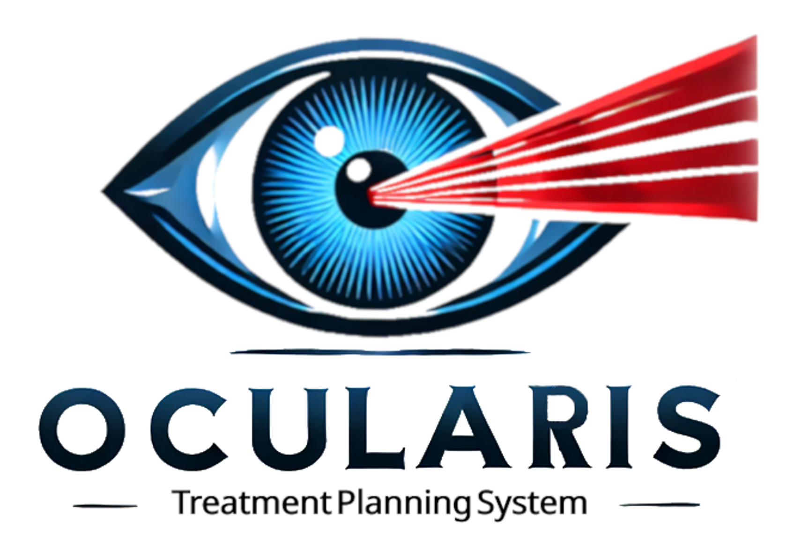
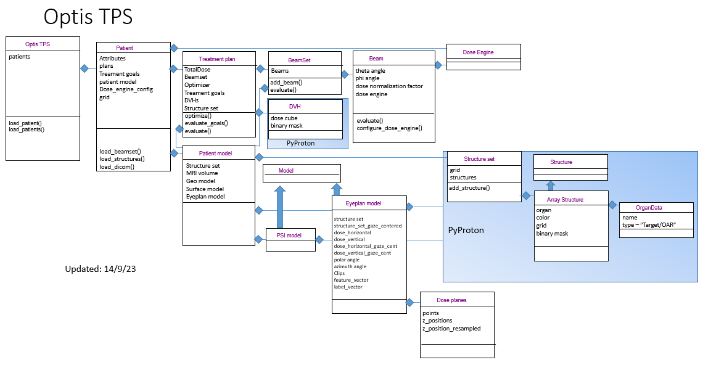
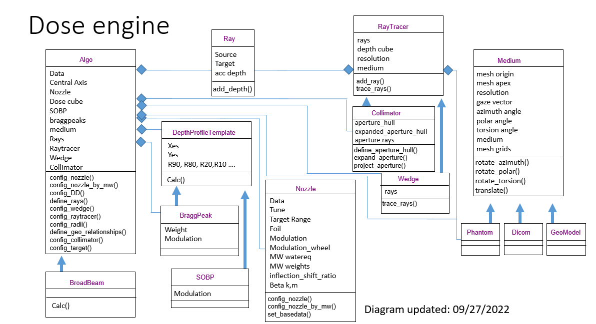

Dependencies:
Pyvista / VTK: https://docs.pyvista.org/version/stable/getting-started/installation.html
Visual studios installed

-------------------------------------------------------------------------------------------

Instructions for getting started:

1. Install visual studios installed https://visualstudio.microsoft.com/downloads/
    Raytracer and resampling in grid for binary mask definitions need VTK libraries which come with the installation

2. Install Anaconda https://www.anaconda.com/download

3. Clone this repository. I can suggest the use of github desktop https://desktop.github.com/ for handling git repos. Note that the git repo needs to be supplied with a public ssh key (In windows powershell write "ssh-keygen". paste public key into gitlab). 

4. Make sure you ( each user ) is working from their own dev branch. New branches can be created in this git repository.

5. Then create a virtual python environment in your anaconda prompt with python version 3.10 and install these packages:
https://docs.pyvista.org/version/stable/getting-started/installation.html. Instruction for creating a virtual environment: https://saturncloud.io/blog/how-to-create-a-conda-environment-with-a-specific-python-version/

6. Make sure you have the required packages installed in your virtual environment. You can install the required packages in your anaconda prompt conda install --file requirements.txt. Relevant info: https://www.educative.io/answers/how-to-create-and-install-conda-requirementstxt

-------------------------------------------------------------------------------------------

Instructions how to include new patient in database

1. Make sure you have matlab installed. It is needed to parse the .pln file

2. Create a new folder with the patient number in your patient data directory. Default: P:\OPTIS2\OptisTPS\patient_database

3. Fill with .pln, .ptd, .xpc, .mil

4. Patient model can be exported using matlab script ep_model_exporter.m

5. Horizontal dose planes used for comparison needs to be exported from within Eyeplan. To do this, first open a patient. Then enter the plane isodoses tab (top panel, centre of second row). Pick the horizontal plane and then "Save dose grid file" from the isodoses dropdown menu.

